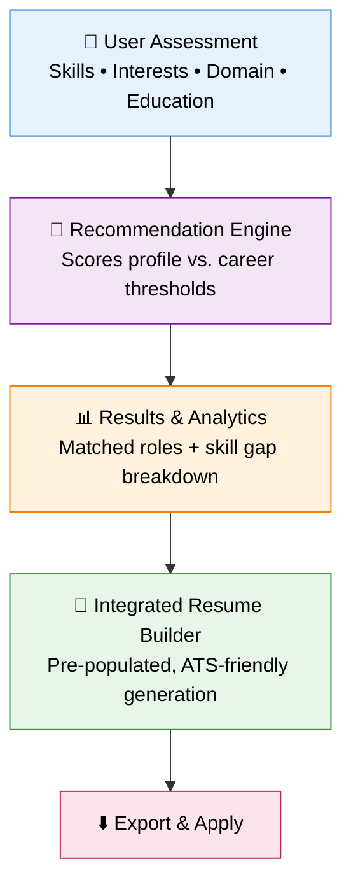

<div align="center">

# 🚀 FuturePathX

### Career Path Recommender & Integrated Resume Builder

*From "What should I become?" to a job-ready resume, in a single flow.*

<br>

[](https://futurepathx-career-recommender.onrender.com)
[](https://www.python.org/)
[](https://flask.palletsprojects.com/)
[](LICENSE)
[](#-contributing)

<br>

### 🌐 [**Live Demo**](https://futurepathx-career-recommender.onrender.com) &nbsp;•&nbsp; [**Features**](#-key-features) &nbsp;•&nbsp; [**Architecture**](#-system-architecture--workflow) &nbsp;•&nbsp; [**Get Started**](#-getting-started-locally) &nbsp;•&nbsp; [**Roadmap**](#-future-roadmap)

</div>

---

**FuturePathX** is an intelligent, end-to-end career guidance platform that bridges the gap between **skill assessment**, **career discovery**, and **job readiness**. By evaluating a user's technical skills, personal interests, domain knowledge, and academic background, it delivers personalized career recommendations, pinpoints critical skill gaps, and instantly generates an **ATS-optimized resume** tailored to the target role.

> 💡 **One platform. Four steps. Zero guesswork.**
> Assess → Match → Close the gaps → Apply.

---

## 📋 Table of Contents

- [Overview](#-overview)
- [Key Features](#-key-features)
- [System Architecture & Workflow](#-system-architecture--workflow)
- [How the Recommendation Engine Works](#-how-the-recommendation-engine-works)
- [Supported Career Paths](#-supported-career-paths)
- [Tech Stack](#-tech-stack)
- [Project Structure](#-project-structure)
- [Screenshots & UI Walkthrough](#-screenshots--ui-walkthrough)
- [Getting Started Locally](#-getting-started-locally)
- [Deployment](#-deployment)
- [Future Roadmap](#-future-roadmap)
- [Contributing](#-contributing)
- [FAQ](#-faq)
- [License](#-license)
- [Author & Acknowledgments](#-author--acknowledgments)

---

## 📌 Overview

Navigating a career transition, or figuring out where to start as a fresher, is overwhelming and fragmented. Students juggle career quizzes in one tab, skill roadmaps in another, and resume templates in a third. **FuturePathX** collapses all of that into one dynamic pipeline:

| Step | Stage | What Happens |
|:---:|---|---|
| **1** | 📝 **Self-Assessment** | Users complete an interactive questionnaire covering core skills, domain preferences, and educational background. |
| **2** | 🧠 **Recommendation Engine** | The algorithm scores user inputs against multi-faceted career profiles (Data Science, Web Development, Cyber Security, Cloud Engineering, and more) to compute role alignment. |
| **3** | 📈 **Skill Gap Analysis** | Highlights the exact technical and soft skills a user must master to reach full proficiency in their chosen path. |
| **4** | 📄 **Automated Resume Builder** | Details are populated into clean, ATS-compliant layouts customized for the recommended career trajectory. |

---

## 🌟 Key Features

<table>
<tr>
<td width="50%" valign="top">

### 🎯 Smart Career Matching
Data-driven scoring evaluates every response and ranks the career paths that best fit the user's strengths and interests.

</td>
<td width="50%" valign="top">

### 📈 Skill Gap Identification
Pinpoints missing competencies for a target role so learning stays focused, not scattered.

</td>
</tr>
<tr>
<td width="50%" valign="top">

### 📄 Integrated Resume Generator
Builds tailored, ATS-friendly resumes directly from the assessment profile. No re-entering data.

</td>
<td width="50%" valign="top">

### 🎨 Interactive & Responsive UI
A clean, modern interface built for smooth engagement on desktop, tablet, and mobile.

</td>
</tr>
<tr>
<td width="50%" valign="top">

### ⚡ Instant Export & Preview
Review your resume live, then export it in seconds, ready for immediate job applications.

</td>
<td width="50%" valign="top">

### 🔗 Seamless End-to-End Flow
Assessment data flows straight into recommendations, gap analysis, and the resume. One profile, every stage.

</td>
</tr>
</table>

---

## 🏗️ System Architecture & Workflow



<details>
<summary><b>📐 Plain-text version of the architecture</b></summary>

```text
 ┌──────────────────────────┐
 │     User Assessment      │  <-- Interactive Skill & Domain Questionnaire
 └─────────────┬────────────┘
               │
               ▼
 ┌──────────────────────────┐
 │  Recommendation Engine   │  <-- Scores Profile vs. Career Thresholds
 └─────────────┬────────────┘
               │
               ▼
 ┌──────────────────────────┐
 │   Results & Analytics    │  <-- Matched Roles & Skill Gap Breakdown
 └─────────────┬────────────┘
               │
               ▼
 ┌──────────────────────────┐
 │ Integrated Resume Builder│  <-- Pre-populated, ATS-Friendly Resume Generation
 └──────────────────────────┘
```

</details>

---

## 🧠 How the Recommendation Engine Works

1. **Input Collection:** Answers about skills, interests, domain familiarity, and academics are captured as a structured profile.
2. **Weighted Scoring:** Each career path defines a set of required skills and interest signals. The user's profile is scored against each one.
3. **Threshold Matching:** Scores are compared with per-career thresholds to determine alignment.
4. **Ranking:** Careers are ranked, and the top matches are surfaced with a clear alignment score.
5. **Gap Computation:** For the chosen role, the engine diffs *skills required* against *skills possessed* to produce a prioritized learning list.

```text
Match Score (career) = Σ ( weight(skill) × user_proficiency(skill) ) / Σ weight(skill)
Skill Gap (career)   = Required Skills − User Skills
```

---

## 🧭 Supported Career Paths

| Domain | Example Roles |
|---|---|
| 📊 **Data Science** | Data Analyst, Data Scientist, ML Engineer |
| 🌐 **Web Development** | Frontend, Backend, Full-Stack Developer |
| 🔐 **Cyber Security** | Security Analyst, Penetration Tester |
| ☁️ **Cloud Engineering** | Cloud Engineer, DevOps Engineer |

> More career profiles can be added easily by extending the career dataset. See [Contributing](#-contributing).

---

## 🛠️ Tech Stack

| Layer | Technology |
|---|---|
| **Language** |  |
| **Backend Framework** |  |
| **Frontend** |    |
| **Hosting** |  |
| **Version Control** |   |

---

## 📁 Project Structure

```text
futurepathx-career-recommender/
│
├── app.py                  # Flask application entry point & routes
├── requirements.txt        # Python dependencies
├── Procfile                # Process definition for deployment
│
├── templates/              # Jinja2 HTML templates
│   ├── index.html          # Landing page
│   ├── assessment.html     # Interactive questionnaire
│   ├── results.html        # Career matches & skill gap analysis
│   └── resume.html         # Resume builder & preview
│
├── static/
│   ├── css/                # Stylesheets
│   ├── js/                 # Client-side scripts
│   └── images/             # Icons, screenshots, assets
│
└── README.md
```

> ⚠️ Adjust this tree to match your actual repository layout.

---

## 📸 Screenshots & UI Walkthrough

> Replace the placeholders below with real screenshots stored in `static/images/` or a `docs/` folder.

| 1️⃣ Landing Page | 2️⃣ Skill Assessment |
|:---:|:---:|
|  |  |
| *Clean entry point to begin your journey* | *Interactive skill & domain questionnaire* |

| 3️⃣ Career Recommendations | 4️⃣ Resume Builder |
|:---:|:---:|
|  |  |
| *Ranked matches with skill gap breakdown* | *ATS-friendly resume, live preview & export* |

---

## 💻 Getting Started Locally

### Prerequisites

- **Python 3.8+**
- **pip** (Python package manager)
- **Git**

### Installation

```bash
# 1. Clone the repository
git clone https://github.com/<your-username>/futurepathx-career-recommender.git
cd futurepathx-career-recommender

# 2. Create and activate a virtual environment
python -m venv venv

# macOS / Linux
source venv/bin/activate
# Windows
venv\Scripts\activate

# 3. Install dependencies
pip install -r requirements.txt

# 4. Run the application
python app.py
```

### Open in your browser

```text
http://127.0.0.1:5000
```

---

## ☁️ Deployment

FuturePathX is deployed on **[Render](https://render.com)**. To deploy your own instance:

1. Fork or push this repository to your GitHub account.
2. On Render, click **New → Web Service** and connect the repository.
3. Configure the service:

| Setting | Value |
|---|---|
| **Environment** | Python 3 |
| **Build Command** | `pip install -r requirements.txt` |
| **Start Command** | `gunicorn app:app` |

4. Click **Create Web Service**. Render builds and deploys automatically on every push.

> ⏱️ On free-tier hosting, the first request after a period of inactivity may take a few seconds while the server wakes up.

---

## 🔮 Future Roadmap

- [ ] 🤖 **AI-powered recommendations** using ML models trained on real job-market data
- [ ] 🗺️ **Personalized learning roadmaps** with curated courses and resources per skill gap
- [ ] 📑 **Multiple resume templates** with one-click style switching
- [ ] 📥 **PDF & DOCX export** with pixel-perfect formatting
- [ ] 🔍 **ATS score checker** to score a resume against a job description
- [ ] 💼 **Live job listings integration** matched to recommended roles
- [ ] 👤 **User accounts & saved profiles** to track progress over time
- [ ] 🌍 **Multi-language support**
- [ ] 📊 **Progress dashboard** for skills acquired and milestones reached

---

## 🤝 Contributing

Contributions make the open-source community great. Any contribution is **greatly appreciated**.

1. **Fork** the project
2. **Create** your feature branch
   ```bash
   git checkout -b feature/AmazingFeature
   ```
3. **Commit** your changes
   ```bash
   git commit -m "Add some AmazingFeature"
   ```
4. **Push** to the branch
   ```bash
   git push origin feature/AmazingFeature
   ```
5. **Open a Pull Request**

💡 Good first contributions: adding new career profiles, improving the scoring logic, adding resume templates, or polishing the UI.

---

## ❓ FAQ

<details>
<summary><b>Is FuturePathX free to use?</b></summary>
Yes. The live application is free and open source under the MIT license.
</details>

<details>
<summary><b>What does "ATS-friendly" mean?</b></summary>
Applicant Tracking Systems parse resumes automatically. FuturePathX uses clean, single-column layouts with standard headings so recruiters' software can read your resume correctly.
</details>

<details>
<summary><b>Can I add my own career paths?</b></summary>
Absolutely. Extend the career dataset with the required skills and thresholds for a new role and the engine picks it up automatically.
</details>

---

## 📄 License

Distributed under the **MIT License**. See [`LICENSE`](LICENSE) for more information.

---

## 👤 Author & Acknowledgments

**Your Name**
[](https://github.com/<your-username>)
[](https://linkedin.com/in/<your-profile>)

Built with ❤️ to help students and early-career professionals find their path.

<div align="center">

### ⭐ If FuturePathX helped you, consider giving it a star!

**[🌐 Try the Live Demo](https://futurepathx-career-recommender.onrender.com)**

</div>
